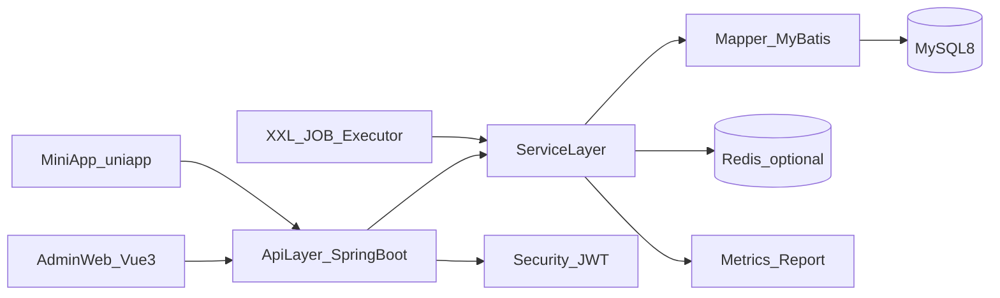

# 烟火小食单重规划（技术选型优先）

## 目标与边界
- 目标：在 `1-2 个月` 内交付可用的完整 V1，覆盖你选定的 7 大模块（用户鉴权、菜品中心、菜单模板、做饭会话、评分复盘、后台运营、数据报表）。
- 基线约束：严格基于现有后端技术选型与分层约定（`Spring Boot 3 + MyBatis + MySQL 8 + Log4j2 + springdoc + XXL-JOB`），参考文档 [`/Users/maxiaofei/mygithub/menu/docs/技术选型.md`](/Users/maxiaofei/mygithub/menu/docs/技术选型.md)。
- 数据基础：沿用现有库表设计，优先复用并补齐最小字段，不做大规模推翻，参考 [`/Users/maxiaofei/mygithub/menu/docs/db_init.sql`](/Users/maxiaofei/mygithub/menu/docs/db_init.sql)。

## 交付架构（V1）

## 多模块 Maven 目标形态（确认版）
- 模块命名采用：`boot`、`controller`、`service`、`mapper`、`common`。
- 模块职责：
  - `boot`：启动类、配置装配、运行时集成（Swagger/Security/MyBatis 扫描等）。
  - `controller`：接口层（Controller、请求/响应 DTO、参数校验、接口文档注解）。
  - `service`：业务编排与领域规则（不直接暴露 Web 协议细节）。
  - `mapper`：数据访问（Entity、Mapper 接口、MyBatis XML、Repository 实现）。
  - `common`：通用能力（统一响应、异常基类、常量、工具类、通用枚举）。
- 依赖方向（强约束）：
  - `controller -> service -> mapper -> common`
  - `boot -> controller/service/mapper/common`
  - 禁止反向依赖（尤其 `mapper` 不能依赖 `controller`）。

## 模块级包路径模板（落地模板）
- 根包建议统一为：`com.warmbitwes.menu`
- `common` 模块：
  - `com.warmbitwes.menu.common.response`
  - `com.warmbitwes.menu.common.exception`
  - `com.warmbitwes.menu.common.enums`
  - `com.warmbitwes.menu.common.util`
- `mapper` 模块：
  - `com.warmbitwes.menu.mapper.entity`
  - `com.warmbitwes.menu.mapper.dao`
  - `com.warmbitwes.menu.mapper.repository`（可选，封装复杂访问）
  - `src/main/resources/mapper/**/*.xml`
- `service` 模块：
  - `com.warmbitwes.menu.service`
  - `com.warmbitwes.menu.service.impl`
  - `com.warmbitwes.menu.service.model`（领域对象/内部传输对象，可选）
- `controller` 模块：
  - `com.warmbitwes.menu.controller.api`
  - `com.warmbitwes.menu.controller.dto.req`
  - `com.warmbitwes.menu.controller.dto.resp`
  - `com.warmbitwes.menu.controller.vo`（兼容已有输出模型）
- `boot` 模块：
  - `com.warmbitwes.menu.boot`（`MenuApplication`）
  - `com.warmbitwes.menu.boot.config`（MyBatis/Security/Springdoc 配置）
  - `com.warmbitwes.menu.boot.advice`（全局异常入口，可按需放 `controller`）

## 父子 POM 依赖清单（执行基线）

### 父工程（root `pom.xml`）
- `packaging` 设为 `pom`，统一声明 modules：`common`、`mapper`、`service`、`controller`、`boot`。
- 使用 `dependencyManagement` 统一版本：
  - `spring-boot-dependencies`
  - `mybatis-spring-boot-starter`
  - `springdoc-openapi`
  - `xxl-job-core`
- 使用 `pluginManagement` 统一插件：
  - `maven-compiler-plugin`（Java 17）
  - `spring-boot-maven-plugin`（仅 `boot` 模块实际执行打包）

### 子模块依赖关系（只保留必要依赖）
- `common`：
  - 仅保留最小通用依赖（如 `validation-api`、`commons-lang3` 按需），禁止依赖业务模块。
- `mapper`：
  - 依赖：`common`、`mybatis-spring-boot-starter`、`mysql-connector-j`（runtime）。
- `service`：
  - 依赖：`common`、`mapper`。
- `controller`：
  - 依赖：`common`、`service`、`spring-boot-starter-web`、`spring-boot-starter-validation`。
- `boot`：
  - 依赖：`common`、`mapper`、`service`、`controller`，并汇总运行时依赖（安全、springdoc、log4j2、xxl-job）。

### 构建与发布约束
- 只有 `boot` 模块包含可执行入口和最终制品（WAR/JAR）配置。
- 禁止在 `controller/service/mapper/common` 子模块配置应用启动主类。
- 所有子模块版本跟随父工程统一版本，禁止单独漂移。

## 单体到多模块的渐进迁移计划（V1 前置里程碑）

当前状态：
- M1：已完成
- M2：已完成
- M3：已完成
- M4：已完成（已完成模块收口，待本地启动回归）

### 阶段 M1：工程骨架拆分（第 1 周）
- 根 `pom` 改为聚合工程（`packaging=pom`），新增 `boot/controller/service/mapper/common` 子模块。
- 保持业务代码暂不大规模移动，先保证模块可编译、可启动。
- 验收标准：父子模块依赖生效，`boot` 可以启动应用。

### 阶段 M2：通用与数据层迁移（第 2-3 周）
- 先迁移 `common`（响应体、异常、工具），再迁移 `mapper`（Entity/Mapper/XML）。
- 统一 `@MapperScan` 与 `mybatis.mapper-locations` 到多模块路径。
- 验收标准：核心查询/写入接口可用，SQL 映射无丢失。

### 阶段 M3：业务与接口层迁移（第 4-5 周）
- 迁移 `service` 业务逻辑，再迁移 `controller` 接口层与 DTO。
- 完成鉴权拦截、参数校验、统一异常链路在多模块下的贯通。
- 验收标准：Swagger 可访问、核心业务链路联调通过。

### 阶段 M4：稳定与收口（第 6 周）
- 清理跨层引用、去除历史耦合代码、补齐模块 README 与边界约束。
- 增加模块级回归清单（启动、登录、菜品、模板、会话、评分、报表）。
- 验收标准：无反向依赖、可稳定发布、回归通过。

## 版本规划

### V1（1-2 个月）
- 用户与权限：账号、角色、登录、JWT 鉴权、接口权限拦截、基础审计日志。
- 菜品中心：食材/菜品/分类/标签/菜系的 CRUD 与关联管理，支持检索、分页、状态管理。
- 菜单模板：模板 CRUD、模板-菜品关系管理、按场景/口味/人群筛选。
- 做饭会话：创建会话、会话选菜、备菜清单生成与状态流转。
- 评分复盘：口味/难度/复做意愿录入，生成菜品复盘数据。
- 运营后台：字典配置（场景/口味/人群）、开关配置、基础内容维护。
- 报表能力：按时间维度统计会话数、菜品使用频次、评分分布。

### V2（演进）
- 推荐策略：基于历史评分和使用频次的个性化推荐。
- 异步化与任务化：报表聚合、推荐计算、数据修复任务接入 XXL-JOB。
- 性能与稳定性：热点缓存、读写优化、慢 SQL 治理、观测告警完善。

## 里程碑与阶段任务

### 阶段 1：基座固化（第 1-2 周）
- 完成从单体分层到多模块骨架的第一阶段落地（`boot/controller/service/mapper/common`）。
- 完成统一响应、统一异常、参数校验、分页模型、错误码规范。
- 引入鉴权骨架（Spring Security + JWT）与登录态拦截。
- 建立环境配置分层（`dev/test/prod`）与本地启动脚本。

### 阶段 2：核心域上线（第 3-5 周）
- 菜品中心与模板中心全链路（接口 + 服务 + SQL）完成并联调。
- 做饭会话 + 备菜清单 + 评分复盘打通业务主流程。
- 管理后台首版页面与接口联调完成。

### 阶段 3：运营与数据（第 6-8 周）
- 完成基础统计报表接口与后台展示。
- 增加关键操作日志与慢查询监控。
- 回归测试、压测、发布清单与上线验收。

## 模块级实施顺序（后端优先）
- `P0`：鉴权与全局治理（异常、响应、校验、日志）。
- `P1`：菜品中心 + 菜单模板（核心数据生产）。
- `P1`：做饭会话 + 评分复盘（核心数据消费与闭环）。
- `P2`：运营配置与报表（管理和决策支持）。

## 数据与接口策略
- 数据层：优先复用现有表结构，新增字段遵循 `remark + DATETIME(3)` 规范；变更脚本版本化管理。
- 接口层：遵循统一响应约定（`code/message/data`），读写分 DTO，查询接口统一分页。
- 安全层：登录、刷新、登出、权限校验闭环；敏感接口默认鉴权。

## 风险与控制
- 鉴权接入晚会导致返工：阶段 1 必须先落地安全骨架。
- SQL 演进不可追踪：从现在开始执行版本化迁移策略（避免仅维护全量脚本）。
- 模块并行冲突：统一 API 契约与错误码，按模块 owner 划分联调窗口。

## 与脑图对齐机制（你补充后执行）
- 将脑图节点映射为：`模块 > 子功能 > 接口 > 数据表 > 里程碑` 五层。
- 对每个脑图节点标记 `V1 必做 / V1 可选 / V2`。
- 输出差异清单：`脑图有但技术方案未覆盖`、`技术方案有但脑图未定义`，逐项决策。

## 本地验证步骤（多模块改造后）

### 1) 构建验证
- 在项目根目录执行：
  - `mvn -pl boot -am clean package`
- 预期结果：
  - `boot` 模块构建成功；
  - 无模块循环依赖报错；
  - 生成 `boot/target/menu-backend.war`（或对应构建产物）。

### 2) 启动验证
- 在项目根目录执行：
  - `mvn -pl boot -am spring-boot:run`
- 预期结果：
  - 应用成功启动，无 `ClassNotFoundException`、`NoSuchBeanDefinitionException`；
  - MyBatis Mapper 扫描正常；
  - 日志配置生效，控制台输出正常。

### 3) 基础接口回归
- 健康检查：
  - `GET /menu/api/health`
  - 预期：`{"code":0,"message":"success","data":"ok"}`
- 菜品详情：
  - `GET /menu/api/dishes/{id}`
  - 预期：存在数据时返回 `DishDetailVO`；不存在返回业务异常结构。
- 食材管理：
  - `GET /menu/api/ingredients`
  - `GET /menu/api/ingredients/{id}`
  - `POST /menu/api/ingredients`
  - `PUT /menu/api/ingredients/{id}`
  - `DELETE /menu/api/ingredients/{id}`
  - 预期：成功返回 `code=0`；参数错误返回统一校验错误结构。

### 4) 通过标准
- 模块边界符合约束：`controller -> service -> mapper -> common`，`boot` 仅聚合运行。
- 根目录不再承担业务源码角色（仅父工程与文档）。
- 接口统一响应、全局异常处理与参数校验链路可用。
- 启动、核心接口回归、构建打包三项全部通过。

## 常见失败排查（多模块）

### 1) 启动时报 Bean 找不到
- 典型报错：`NoSuchBeanDefinitionException`
- 排查要点：
  - 确认 `boot` 模块依赖已包含 `controller/service/mapper/common`。
  - 确认实现类上有正确注解（如 `@Service`、`@RestController`）。
  - 确认启动类包路径能覆盖所有子模块包（当前为 `com.warmbitwes.menu`）。

### 2) Mapper 接口或 XML 未生效
- 典型报错：`Invalid bound statement`、`NoSuchMapper`
- 排查要点：
  - `MenuApplication` 上 `@MapperScan("com.warmbitwes.menu.mapper")` 是否正确。
  - `application.yml` 中 `mybatis.mapper-locations: classpath:mapper/**/*.xml` 是否匹配 `mapper` 模块资源目录。
  - `mapper` 接口的 `namespace` 与 XML 一致，方法签名一致。

### 3) 打包成功但运行缺类
- 典型报错：`ClassNotFoundException` / `NoClassDefFoundError`
- 排查要点：
  - 子模块依赖是否在对应 `pom.xml` 正确声明。
  - 是否误把运行期依赖放到错误 scope（如本应 `runtime` 却缺失）。
  - 重新执行 `mvn -pl boot -am clean package` 清理后构建。

### 4) 接口返回结构不一致
- 现象：部分接口不是 `{code,message,data}` 格式
- 排查要点：
  - Controller 是否统一使用 `ApiResponse` 包装。
  - 异常是否由 `GlobalExceptionHandler` 接管。
  - 参数校验异常是否命中统一处理器。

### 5) 改造后路径混乱
- 现象：新旧目录都有同名类，导致编译或运行行为异常
- 排查要点：
  - 确保旧 `src/main/java`、`src/main/resources` 中迁移文件已清理。
  - 避免同包名同类在多个模块重复存在。
  - 用 `git status` 核对删除与新增是否一一对应。
